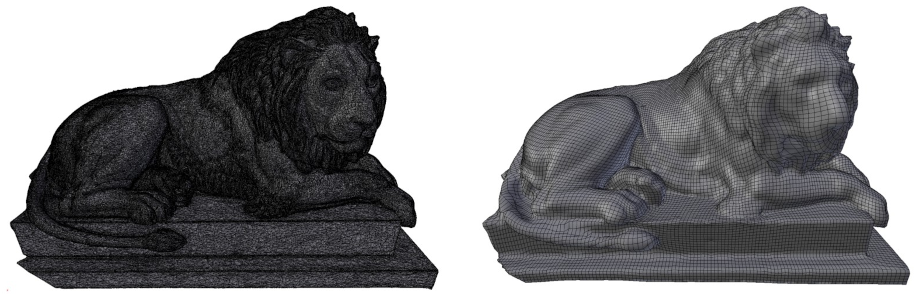
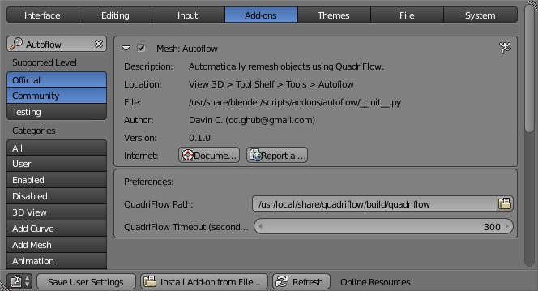
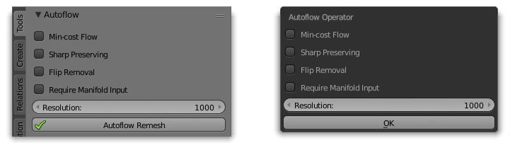

# Autoflow: Blender Add-On For Quad-Based Remeshing

Autoflow is a Blender add-on that adds QuadriFlow remeshing capabilities to Blender 2.78 and 2.79 (Figure 1).  Such older versions of Blender are more suitable for low-end hardware but lack newer Blender features such as QuadriFlow.  This add-on works on Linux and Windows operating systems and supports all flags available to QuadriFlow.

**Figure 1:** A high-polygon lion mesh (left) is remeshed in Blender 2.78 using Autoflow (right).

## Getting Started

### Prerequisites

The following software is required:

* [Blender 2.78 or 2.79](https://download.blender.org/release/)
* [QuadriFlow](https://github.com/hjwdzh/QuadriFlow)

Optional: the following utilities enable QuadriFlow's "Flip Removal" on Linux:

* [minisat](https://github.com/niklasso/minisat)
* [timeout](https://www.man7.org/linux/man-pages/man1/timeout.1.html)

### Installation

Place the autoflow folder into the Blender 2.7x add-on folder on your computer.  The path of the add-on folder ends with something similar to Blender/2.79/scripts/addons.  Activate the add-on in Blender’s File > User Preferences > Add-ons > Mesh > Autoflow by ticking the box next to “Mesh: Autoflow.”   In the Autoflow preferences window, inside the add-on's QuadriFlow Path text entry box, enter the path to your QuadriFlow executable file (Figure 2).

**Figure 2:** The Autoflow preferences window shows that Autoflow is activated, and the QuadriFlow Path preference is pointing to the QuadriFlow executable.

## Usage

Autoflow can be controlled in two ways: from the Autoflow panel in the Blender 3D viewport's Tool Shelf > Tools > Autoflow or from a popup dialog that appears in the 3D viewport after pressing Ctrl+R (Figure 3).  The panel and popup dialog have identical options, each described in detail below.  After the desired options are selected, press the button labeled “Autoflow Remesh” (if you are using the panel) or the button labeled “OK” (if you are using the popup dialog) to remesh Blender's active object.

**Figure 3:** The Autoflow panel in the Blender 3D viewport's Tool Shelf (left) and the Autoflow popup dialog (right) both have the same options and functionality.

### Autoflow Options

* **Min-cost Flow:** When this box is ticked, QuadriFlow uses the -mcf flag, enabling the adaptive network simplex minimum-cost flow solver rather than the default Boykov maximum flow solver.

* **Sharp Preserving:** When this box is ticked, QuadriFlow uses the -sharp flag, enabling the detection and preservation of sharp edges in models during remeshing.

* **Flip Removal:** When this box is ticked, QuadriFlow uses the -sat flag, enabling the removal of flips in the integer offsets map during remeshing (this sometimes ensures watertight results).  This option is only available for Linux operating systems.

* **Require Manifold Input:** When this box is ticked, Autoflow checks the active object's mesh to ensure it is manifold before remeshing.  If the box is ticked and the mesh is non-manifold, remeshing is prohibited.

* **Resolution:** This slider value controls the value passed after QuadriFlow's -f flag, which controls the remesh resolution.  The number of faces in the remeshed model increases linearly with this value.

## Credits

The Autoflow add-on was created by Davin C. (davin.github@protonmail.com)

QuadriFlow was created by Jingwei Huang, Yichao Zhou, Matthias Niessner, Jonathan Shewchuk and Leonidas Guibas.  The GitHub repository for QuadriFlow is [here](https://github.com/hjwdzh/QuadriFlow), and the associated license is [here](https://github.com/hjwdzh/QuadriFlow/blob/master/LICENSE.txt).

The 3D model used in this README document was created by geoffreymarchal of BlendSwap.com.  The model is [here](https://www.blendswap.com/blends/view/88099), and the associated license is [here](https://creativecommons.org/licenses/by-nc/3.0/).

## License

The Autoflow add-on for Blender is licensed under version 3 of the GNU General Public License.  See the LICENSE.txt file included with Autoflow for more details.
